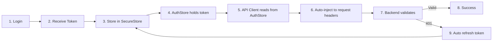

# 📋 Token Setup Summary - Complete Overview

**Created**: 2025-01-30  
**Status**: ✅ Configured with multiple testing options  
**Backend**: SA-Token with Bearer prefix

---

## 🎯 Quick Answer: How Tokens Work Now

### 1. **Where Tokens Are Stored** 🗄️

**Location**: SecureStore (Expo) with AsyncStorage fallback

**Files**:
- **Storage Keys**: `src/features/AuthModule/LoginMainPage/constants.ts` (lines 301-307)
- **Storage Logic**: `src/features/AuthModule/stores/authStore.ts`

**Keys**:
```typescript
SECURE_KEYS = {
  ACCESS_TOKEN: 'access_token',      // ← JWT访问令牌
  REFRESH_TOKEN: 'refresh_token',     // ← 刷新令牌
  USER_CREDENTIALS: 'user_credentials' // ← 用户信息
}
```

**When Stored**:
- ✅ Login success (line 189-191)
- ✅ Token refresh (line 304-307)

**When Cleared**:
- ✅ Logout (line 241-243)
- ✅ Token refresh failed (line 343)

---

### 2. **How Tokens Are Sent** 📤

**File**: `services/api/client.ts`

**Current Default (STANDARD)**:
```typescript
headers: {
  'Authorization': 'Bearer <token>',  // ← OAuth 2.0标准
  'clientid': 'app',                  // ← SA-Token必需
  'Content-Type': 'application/json'
}
```

**Backend Expectation** (from `application-common.yml`):
```yaml
sa-token:
  token-name: Authorization    # ✅ Matches frontend
  token-prefix: "Bearer"       # ✅ Matches frontend
  is-read-header: true         # ✅ Headers enabled
```

**Result**: ✅ **COMPATIBLE - Everything matches!**

---

### 3. **Auto Token Injection** 🔌

**Mechanism**: API Client automatically reads token from AuthStore

**Connection** (`client.ts` lines 231-238):
```typescript
// In your app initialization (_layout.tsx)
apiClient.connectAuthStore(useAuthStore);
```

**Auto-Injection** (`client.ts` lines 453-525):
```typescript
const token = this.getAuthToken();  // ← Get from AuthStore
if (token) {
  requestHeaders['Authorization'] = `Bearer ${token}`;  // ← Auto-inject
  requestHeaders['clientid'] = this.clientId;           // ← Auto-inject
}
```

**Result**: ✅ **No manual token handling needed!**

---

## 🆕 New Features Added

### 1. **Multiple Token Transmission Methods**

You can now test different ways to send tokens:

| Method | Header/Param | Format | Use Case |
|--------|-------------|--------|----------|
| **Authorization Header** | `Authorization: Bearer <token>` | OAuth 2.0 Standard | ✅ **Recommended** (Default) |
| **Custom Headers** | `satoken: <token>`<br>`token: <token>`<br>`X-Token: <token>` | No prefix | Some legacy systems |
| **URL Parameter** | `?Authorization=Bearer%20<token>` | URL encoded | WebSocket, no-header scenarios |
| **ClientId Header** | `clientid: app` | Plain value | ✅ **Required by SA-Token** |

### 2. **Configuration API**

**New Methods in `client.ts`**:

```typescript
// Configure token transmission
apiClient.configureTokenTransmission({
  useAuthorizationHeader: true,   // Enable/disable Authorization header
  tokenPrefix: 'Bearer',          // Token prefix (or '' for no prefix)
  useCustomHeaders: false,        // Enable/disable custom headers
  customHeaderNames: ['satoken'], // Custom header names
  useUrlParameter: false,         // Enable/disable URL parameter
  includeClientId: true,          // Enable/disable clientId header
  clientIdHeaderName: 'clientid', // ClientId header name
  enableDebugLogs: true,          // Enable/disable detailed logs
});

// Get current config
const config = apiClient.getTokenConfig();

// Set client ID
apiClient.setClientId('app');
```

### 3. **Test Utilities**

**New File**: `services/api/tokenTestUtils.ts`

**Quick Functions**:
```typescript
import { 
  switchTokenPreset,           // Switch to a preset config
  printTokenConfig,            // Print current config
  testAllPresets,             // Test all presets
  printAllPresetDescriptions  // Show all preset descriptions
} from '@/services/api/tokenTestUtils';

// Example usage:
switchTokenPreset('STANDARD');      // Standard OAuth 2.0
switchTokenPreset('NO_PREFIX');     // Without "Bearer"
switchTokenPreset('CUSTOM_HEADERS'); // Custom headers
switchTokenPreset('ALL_METHODS');   // All methods at once
```

**Available Presets**:
1. `STANDARD` - OAuth 2.0 standard (recommended) ✅
2. `NO_PREFIX` - No "Bearer" prefix
3. `CUSTOM_HEADERS` - satoken, token, X-Token headers
4. `URL_PARAMETER` - ?Authorization=<token>
5. `ALL_METHODS` - All methods combined (for debugging)
6. `MINIMAL` - Bare minimum (just token, no clientid)
7. `SILENT` - Standard but with logs disabled

---

## 📁 File Structure

```
XiangYuPai-RNExpoAPP/
├── services/api/
│   ├── client.ts                    ← 🆕 Enhanced with multi-method support
│   ├── tokenTestUtils.ts            ← 🆕 Testing utilities
│   ├── authApi.ts                   ← Login/logout/refresh APIs
│   ├── profileApi.ts                ← Profile APIs (uses token)
│   └── config.ts                    ← API configuration
│
├── src/features/AuthModule/
│   ├── stores/
│   │   └── authStore.ts             ← Token storage & management
│   ├── LoginMainPage/
│   │   ├── constants.ts             ← SECURE_KEYS defined here
│   │   └── index.tsx                ← Login page
│   └── utils/
│       └── credentialStorage.ts     ← Save/load credentials
│
├── TOKEN_MANAGEMENT_GUIDE.md        ← 🆕 Complete token flow guide
├── TOKEN_TESTING_GUIDE.md           ← 🆕 How to test different methods
└── 📋_TOKEN_SETUP_SUMMARY.md        ← 🆕 This file
```

---

## 🔄 Complete Token Flow

### Login → Store → Use → Refresh



**Detailed Steps**:

1. **User logs in** (`LoginMainPage/index.tsx`)
   ```typescript
   await authStore.login({ phone, password });
   ```

2. **Backend returns tokens** (`authApi.ts` line 176-180)
   ```typescript
   {
     accessToken: "eyJhbGc...",
     refreshToken: "eyJhbGc...",
     expiresIn: 86400,
     userInfo: {...}
   }
   ```

3. **Store tokens securely** (`authStore.ts` line 189-191)
   ```typescript
   await SecureStore.setItemAsync('access_token', accessToken);
   await SecureStore.setItemAsync('refresh_token', refreshToken);
   ```

4. **API Client connects to AuthStore** (`app/_layout.tsx`)
   ```typescript
   apiClient.connectAuthStore(useAuthStore);
   ```

5. **Auto token injection** (`client.ts` line 453-525)
   ```typescript
   const token = this.getAuthToken();
   requestHeaders['Authorization'] = `Bearer ${token}`;
   requestHeaders['clientid'] = this.clientId;
   ```

6. **Backend Gateway validates** (Backend: `AuthFilter.java`)
   ```java
   // Check Authorization header
   String tokenValue = request.getHeader("Authorization");
   // Remove "Bearer " prefix
   String token = tokenValue.substring(7);
   // Validate token
   StpUtil.checkLogin();
   // Check clientid matches
   String clientIdInToken = StpUtil.getExtra("clientid");
   String clientIdInHeader = request.getHeader("clientid");
   if (!clientIdInToken.equals(clientIdInHeader)) {
     return 401;  // "客户端ID与Token不匹配"
   }
   ```

7. **Request succeeds** → User sees data

8. **If 401 occurs** (`client.ts` line 299-344)
   ```typescript
   // Auto refresh token
   await authStore.refreshAuthToken();
   // Retry original request
   return await this.makeRequest(...);
   ```

---

## 🧪 How to Test

### Quick Test in Your App

Add this to any page (e.g., `app/(tabs)/homepage.tsx`):

```typescript
import { useEffect } from 'react';
import { switchTokenPreset, printTokenConfig } from '@/services/api/tokenTestUtils';
import { profileApi } from '@/services/api/profileApi';

export default function Homepage() {
  useEffect(() => {
    async function testToken() {
      console.log('\n🧪 Starting Token Test...\n');
      
      // 1. Check current config
      printTokenConfig();
      
      // 2. Test standard config
      switchTokenPreset('STANDARD');
      
      // 3. Try an API call
      try {
        const profile = await profileApi.getUserProfile(2000);
        console.log('✅ Token works! Profile:', profile.nickname);
      } catch (error) {
        console.log('❌ Token failed:', error.message);
        
        // 4. If failed, try all methods
        console.log('\n🔄 Trying all methods...\n');
        switchTokenPreset('ALL_METHODS');
        
        try {
          const profile = await profileApi.getUserProfile(2000);
          console.log('✅ All methods works!');
        } catch (error2) {
          console.log('❌ All methods failed - Token might be invalid');
          console.log('   Solution: Re-login to get new token');
        }
      }
    }
    
    testToken();
  }, []);
  
  // ... rest of component
}
```

### Expected Console Output (Success)

```
🔧 [API Client] Token传输配置已更新
━━━━━━━━━━━━━━━━━━━━━━━━━━━━━━━━
   Authorization Header: ✅
   Custom Headers: ❌
   URL Parameter: ❌
   ClientId Header: ✅ clientid: app
   Token Prefix: Bearer
━━━━━━━━━━━━━━━━━━━━━━━━━━━━━━━━

🔑 [Token Injection] 准备注入Token
━━━━━━━━━━━━━━━━━━━━━━━━━━━━━━━━
   请求: GET /xypai-user/api/v2/user/profile/2000
   Token (前20字符): eyJhbGciOiJIUzI1NiI...
   Token (长度): 234 字符
   ✅ [Method 1] Authorization Header
      Header: Authorization: Bearer eyJhbGciOi...
      格式: Bearer <token>
━━━━━━━━━━━━━━━━━━━━━━━━━━━━━━━━

🔑 [ClientId] 已添加ClientId Header
   Header: clientid: app
   说明: 必须与登录时的clientType一致！

✅ Token works! Profile: Alice
```

---

## 🔧 Configuration Checklist

### ✅ Current Status

| Component | Configuration | Status | Notes |
|-----------|--------------|--------|-------|
| **Frontend Storage** | SecureStore | ✅ | Encrypted |
| **Frontend Headers** | `Authorization: Bearer <token>` | ✅ | OAuth 2.0 standard |
| **Frontend ClientId** | `clientid: app` | ✅ | Matches backend |
| **Backend Token Name** | `Authorization` | ✅ | Matches frontend |
| **Backend Token Prefix** | `Bearer` | ✅ | Matches frontend |
| **Backend ClientId Check** | Required | ✅ | Gateway validates |
| **Auto Token Injection** | Enabled | ✅ | Via connectAuthStore |
| **Auto Token Refresh** | Enabled | ✅ | On 401 errors |
| **Multi-Method Support** | Available | 🆕 | For testing |

**Conclusion**: ✅ **Everything is properly configured!**

---

## 🐛 Troubleshooting

### Problem 1: Still getting 401 after login

**Check**:
```typescript
// 1. Is token stored?
import { useAuthStore } from '@/features/AuthModule/stores/authStore';
const { accessToken, isAuthenticated } = useAuthStore();
console.log('Authenticated:', isAuthenticated);
console.log('Token:', accessToken?.substring(0, 20));
```

**If no token** → Login failed, check credentials  
**If has token** → Token might be invalid, try re-login

---

### Problem 2: "客户端ID与Token不匹配"

**Cause**: ClientId in header doesn't match clientId in token

**Fix**:
```typescript
// Ensure consistent clientType
// Login:
await authApi.loginWithPassword({
  clientType: 'app',  // ← Must be 'app'
});

// API Client:
apiClient.setClientId('app');  // ← Must match
```

---

### Problem 3: Token not being sent

**Check**:
```typescript
// 1. Is API Client connected to AuthStore?
// In app/_layout.tsx:
apiClient.connectAuthStore(useAuthStore);

// 2. Check logs
switchTokenPreset('STANDARD');
// Should see "🔑 [Token Injection] 准备注入Token"
```

---

## 📚 Documentation Files

1. **`TOKEN_MANAGEMENT_GUIDE.md`** - Complete guide on token storage, transmission, and flow
2. **`TOKEN_TESTING_GUIDE.md`** - Step-by-step testing guide with examples
3. **`📋_TOKEN_SETUP_SUMMARY.md`** (this file) - Quick reference summary

---

## 🎓 Key Takeaways

### What You Have Now

✅ **Secure Token Storage** - Encrypted in SecureStore  
✅ **Auto Token Injection** - No manual header management  
✅ **Auto Token Refresh** - Handles 401 automatically  
✅ **Multiple Testing Methods** - 7 presets to test different ways  
✅ **Comprehensive Logging** - Detailed debug information  
✅ **Backend Compatible** - Matches SA-Token requirements  

### What You Need to Do

1. **Normal Usage** (no changes needed):
   - Just login → tokens automatically managed
   - All API calls automatically include token
   - 401 errors automatically trigger refresh

2. **If you encounter 401 errors**:
   - Use testing utilities to diagnose
   - Try different presets
   - Check backend logs
   - Refer to troubleshooting guides

3. **Production Setup** (already configured):
   ```typescript
   // app/_layout.tsx
   apiClient.connectAuthStore(useAuthStore);
   apiClient.setClientId('app');
   switchTokenPreset('STANDARD');  // or 'SILENT' for production
   ```

---

## 🎯 Next Steps (If Needed)

### If Everything Works
✅ No action needed! Continue developing your app.

### If You Still Get 401 Errors

1. **Read**: `TOKEN_TESTING_GUIDE.md`
2. **Test**: Use `switchTokenPreset('ALL_METHODS')`
3. **Debug**: Check console logs + backend Gateway logs
4. **Fix**: Based on test results, adjust configuration

### If You Want to Understand More

1. **Read**: `TOKEN_MANAGEMENT_GUIDE.md` - Complete flow documentation
2. **Explore**: `services/api/client.ts` - See implementation
3. **Test**: `services/api/tokenTestUtils.ts` - Try different configurations

---

**Current Status**: ✅ **Fully Configured & Ready to Test**

**Last Updated**: 2025-01-30  
**Backend**: SA-Token with Bearer prefix  
**Frontend**: Expo React Native with SecureStore

---

## 📞 Quick Reference Commands

```typescript
// Import
import { switchTokenPreset, printTokenConfig } from '@/services/api/tokenTestUtils';

// View current config
printTokenConfig();

// Test standard (recommended)
switchTokenPreset('STANDARD');

// Test all methods (debugging)
switchTokenPreset('ALL_METHODS');

// Reset to default
switchTokenPreset('STANDARD');

// Custom config
apiClient.configureTokenTransmission({
  useAuthorizationHeader: true,
  tokenPrefix: 'Bearer',
  includeClientId: true,
});
```

---

**That's it! You now have complete control over token transmission for testing and debugging.** 🎉

