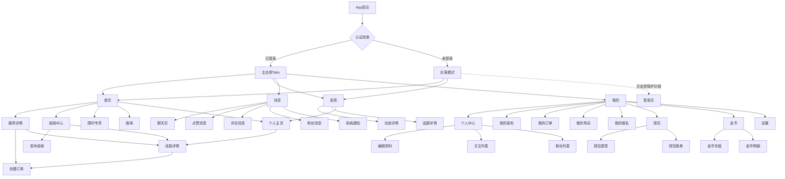

# 📋 页面逻辑与跳转关系文档

> **项目**: 享遇派 React Native Expo App  
> **更新时间**: 2025-11-09  
> **架构**: Expo Router (File-based Routing)

---

## 📑 目录

1. [应用架构概览](#应用架构概览)
2. [路由层级结构](#路由层级结构)
3. [页面分类详解](#页面分类详解)
4. [页面跳转关系图](#页面跳转关系图)
5. [完整页面清单](#完整页面清单)

---

## 🏗️ 应用架构概览

### 认证流程
```
App启动
  ↓
认证初始化 (useAuthInitialization)
  ↓
├─ 已登录 → 进入主应用 (Tabs)
└─ 未登录 → 访客模式 (部分功能受限)
```

### 路由守卫策略
- **白名单路由** (允许匿名访问): 首页、发现
- **受保护路由** (需要登录): 消息、我的
- **访客模式**: 未登录用户可浏览白名单页面，访问受保护页面时显示登录引导

---

## 🗂️ 路由层级结构

```
app/
├── _layout.tsx                    # 根布局 (Stack)
│   ├── auth/                      # 认证路由组
│   │   ├── _layout.tsx
│   │   ├── login.tsx              # 登录页
│   │   └── forgot-password.tsx    # 忘记密码
│   │
│   ├── (tabs)/                    # 主Tab路由组
│   │   ├── _layout.tsx            # Tab布局配置
│   │   ├── index.tsx              # 默认重定向到首页
│   │   │
│   │   ├── homepage/              # 首页模块 (Stack)
│   │   │   ├── _layout.tsx
│   │   │   ├── index.tsx          # 首页主页面
│   │   │   ├── search.tsx         # 搜索页
│   │   │   ├── location.tsx       # 位置选择
│   │   │   ├── filter-online.tsx  # 线上筛选
│   │   │   ├── event-center.tsx   # 组局中心
│   │   │   ├── featured.tsx       # 限时专享
│   │   │   ├── publish-event.tsx  # 发布组局
│   │   │   └── service-detail.tsx # 服务详情
│   │   │
│   │   ├── discover.tsx           # 发现页 (单页面)
│   │   │
│   │   ├── messages/              # 消息模块 (Stack)
│   │   │   ├── _layout.tsx
│   │   │   ├── index.tsx          # 消息主页
│   │   │   ├── likes.tsx          # 点赞消息
│   │   │   ├── comments.tsx       # 评论消息
│   │   │   ├── followers.tsx      # 粉丝消息
│   │   │   ├── notifications.tsx  # 系统通知
│   │   │   └── chat/
│   │   │       └── [conversationId].tsx  # 聊天页
│   │   │
│   │   └── profile.tsx            # 我的页 (单页面)
│   │
│   ├── profile/                   # 个人资料路由组 (Stack)
│   │   ├── _layout.tsx
│   │   ├── [userId].tsx           # 他人主页
│   │   ├── user-profile.tsx       # 个人中心
│   │   ├── edit.tsx               # 编辑资料
│   │   ├── edit-field.tsx         # 编辑字段
│   │   ├── edit-wechat.tsx        # 编辑微信
│   │   ├── select-occupation.tsx  # 选择职业
│   │   ├── skills-edit.tsx        # 编辑技能
│   │   ├── following.tsx          # 关注列表
│   │   ├── followers.tsx          # 粉丝列表
│   │   ├── my-posts.tsx           # 我的发布
│   │   ├── manage-post.tsx        # 管理发布
│   │   ├── my-orders.tsx          # 我的订单
│   │   ├── order-detail.tsx       # 订单详情
│   │   ├── my-purchases.tsx       # 我的购买
│   │   ├── purchase-detail.tsx    # 购买详情
│   │   ├── my-signups.tsx         # 我的报名
│   │   ├── signup-detail.tsx      # 报名详情
│   │   ├── my-status.tsx          # 状态管理
│   │   ├── wallet.tsx             # 钱包
│   │   ├── wallet-withdraw.tsx    # 钱包提现
│   │   ├── wallet-withdraw-success.tsx  # 提现成功
│   │   ├── wallet-bills.tsx       # 钱包账单
│   │   ├── coins.tsx              # 金币
│   │   ├── coins-recharge.tsx     # 金币充值
│   │   ├── coins-recharge-success.tsx   # 充值成功
│   │   ├── coins-bills.tsx        # 金币明细
│   │   ├── settings.tsx           # 设置
│   │   ├── payment-password.tsx   # 支付密码
│   │   ├── customer-service.tsx   # 客服
│   │   └── expert-verification.tsx # 达人认证
│   │
│   ├── feed/
│   │   └── [id].tsx               # 动态详情页
│   │
│   ├── skill/
│   │   └── [skillId].tsx          # 技能详情页
│   │
│   ├── topic/
│   │   └── [topicId].tsx          # 话题详情页
│   │
│   ├── order/
│   │   └── create.tsx             # 创建订单
│   │
│   ├── modal/                     # 模态框路由组
│   │   ├── filter-panel.tsx       # 筛选面板
│   │   ├── location-selector.tsx  # 位置选择器
│   │   ├── topic-selector.tsx     # 话题选择器
│   │   └── user-detail.tsx        # 用户详情
│   │
│   ├── modal.tsx                  # 通用模态框
│   └── publish.tsx                # 发布内容 (模态)
```

---

## 📱 页面分类详解

### 1️⃣ 认证模块 (Auth Module)

| 页面路径 | 页面名称 | 功能说明 | 权限 |
|---------|---------|---------|------|
| `/auth/login` | 登录页 | 手机号登录、验证码登录 | 公开 |
| `/auth/forgot-password` | 忘记密码 | 密码重置 | 公开 |

**跳转关系**:
```
登录页
  ↓ (登录成功)
主应用 (Tabs)

我的页 (未登录)
  ↓ (点击登录)
登录页
```

---

### 2️⃣ 首页模块 (Homepage Module)

#### 主页面
| 页面路径 | 页面名称 | 功能说明 | 权限 |
|---------|---------|---------|------|
| `/(tabs)/homepage/index` | 首页 | 游戏横幅、功能网格、用户列表、限时专享、组局中心 | 白名单 |

#### 子页面
| 页面路径 | 页面名称 | 功能说明 | 跳转来源 |
|---------|---------|---------|---------|
| `/(tabs)/homepage/search` | 搜索页 | 搜索用户、服务、组局 | 首页顶部搜索框 |
| `/(tabs)/homepage/location` | 位置选择 | 选择城市/区域 | 首页顶部位置按钮 |
| `/(tabs)/homepage/filter-online` | 线上筛选 | 筛选线上服务 | 首页筛选按钮 |
| `/(tabs)/homepage/event-center` | 组局中心 | 浏览所有组局活动 | 首页"组局中心"卡片 |
| `/(tabs)/homepage/featured` | 限时专享 | 限时优惠服务列表 | 首页"限时专享"卡片 |
| `/(tabs)/homepage/publish-event` | 发布组局 | 创建新组局活动 | 组局中心"发布"按钮 |
| `/(tabs)/homepage/service-detail` | 服务详情 | 查看服务详情、下单 | 限时专享页 |

**核心跳转流程**:
```
首页
  ├─ 点击用户卡片 → 个人主页 (/profile/[userId])
  ├─ 点击搜索框 → 搜索页
  ├─ 点击位置 → 位置选择页
  ├─ 点击筛选 → 筛选页
  ├─ 点击"组局中心" → 组局中心页
  │   └─ 点击"发布" → 发布组局页
  │   └─ 点击组局卡片 → 技能详情页 (/skill/[skillId])
  └─ 点击"限时专享" → 限时专享页
      └─ 点击服务卡片 → 服务详情页

个人主页 (/profile/[userId])
  ├─ 查看用户资料、技能、动态
  ├─ 点击技能卡片 → 技能详情页 (/skill/[skillId])
  │   └─ 点击"立即下单" → 创建订单页 (/order/create)
  ├─ 点击"私信" → 聊天页
  └─ 点击"关注" → 关注/取消关注

服务详情页 (限时专享使用)
  ├─ 点击"立即下单" → 创建订单页 (/order/create)
  ├─ 点击"技能详情" → 技能详情页 (/skill/[skillId])
  └─ 点击用户头像 → 个人主页 (/profile/[userId])
```

---

### 3️⃣ 发现模块 (Discovery Module)

| 页面路径 | 页面名称 | 功能说明 | 权限 |
|---------|---------|---------|------|
| `/(tabs)/discover` | 发现页 | 三Tab切换(关注/热门/同城)、动态流 | 白名单 |

**跳转关系**:
```
发现页
  ├─ 点击动态 → 动态详情页 (/feed/[id])
  ├─ 点击用户 → 个人主页 (/profile/[userId])
  ├─ 点击话题 → 话题详情页 (/topic/[topicId])
  └─ 点击"关注"按钮 (未登录) → 登录页
```

---

### 4️⃣ 消息模块 (Messages Module)

#### 主页面
| 页面路径 | 页面名称 | 功能说明 | 权限 |
|---------|---------|---------|------|
| `/(tabs)/messages/index` | 消息主页 | 4宫格分类、对话列表 | 受保护 |

#### 子页面
| 页面路径 | 页面名称 | 功能说明 | 跳转来源 |
|---------|---------|---------|---------|
| `/(tabs)/messages/likes` | 点赞消息 | 收到的点赞列表 | 消息主页"点赞"卡片 |
| `/(tabs)/messages/comments` | 评论消息 | 收到的评论列表 | 消息主页"评论"卡片 |
| `/(tabs)/messages/followers` | 粉丝消息 | 新增粉丝列表 | 消息主页"粉丝"卡片 |
| `/(tabs)/messages/notifications` | 系统通知 | 系统消息列表 | 消息主页"通知"卡片 |
| `/(tabs)/messages/chat/[conversationId]` | 聊天页 | 一对一聊天界面 | 消息主页对话列表 |

**核心跳转流程**:
```
消息主页
  ├─ 点击"点赞"卡片 → 点赞消息页
  ├─ 点击"评论"卡片 → 评论消息页
  ├─ 点击"粉丝"卡片 → 粉丝消息页
  ├─ 点击"通知"卡片 → 系统通知页
  └─ 点击对话 → 聊天页

点赞/评论/粉丝消息页
  └─ 点击用户 → 个人主页 (/profile/[userId])

聊天页
  └─ 点击对方头像 → 个人主页 (/profile/[userId])
```

---

### 5️⃣ 我的模块 (Profile Module)

#### 主页面
| 页面路径 | 页面名称 | 功能说明 | 权限 |
|---------|---------|---------|------|
| `/(tabs)/profile` | 我的页 | 用户信息、快捷入口、菜单列表 | 受保护 |

#### 个人中心相关
| 页面路径 | 页面名称 | 功能说明 | 跳转来源 |
|---------|---------|---------|---------|
| `/profile/user-profile` | 个人中心 | 当前用户详细资料（自己） | 我的页"个人中心" |
| `/profile/[userId]` | 个人主页 | 查看他人资料（动态路由） | 首页用户卡片、各处用户头像 |
| `/profile/edit` | 编辑资料 | 编辑个人信息 | 个人中心"编辑"按钮 |
| `/profile/edit-field` | 编辑字段 | 编辑昵称、简介等 | 编辑资料页 |
| `/profile/edit-wechat` | 编辑微信 | 设置微信号 | 编辑资料页 |
| `/profile/select-occupation` | 选择职业 | 选择职业类型 | 编辑资料页 |
| `/profile/skills-edit` | 编辑技能 | 添加/编辑技能标签 | 编辑资料页 |
| `/profile/following` | 关注列表 | 我关注的人 | 个人中心"关注" |
| `/profile/followers` | 粉丝列表 | 关注我的人 | 个人中心"粉丝" |

#### 内容管理
| 页面路径 | 页面名称 | 功能说明 | 跳转来源 |
|---------|---------|---------|---------|
| `/profile/my-posts` | 我的发布 | 我发布的服务/动态 | 我的页"我的发布" |
| `/profile/manage-post` | 管理发布 | 编辑/下架发布内容 | 我的发布页 |

#### 订单管理
| 页面路径 | 页面名称 | 功能说明 | 跳转来源 |
|---------|---------|---------|---------|
| `/profile/my-orders` | 我的订单 | 服务提供者视角的订单 | 我的页"我的订单" |
| `/profile/order-detail` | 订单详情 | 订单详细信息 | 我的订单列表 |
| `/profile/my-purchases` | 我的购买 | 客户视角的购买记录 | 我的页"我的购买" |
| `/profile/purchase-detail` | 购买详情 | 购买订单详情 | 我的购买列表 |
| `/profile/my-signups` | 我的报名 | 组局报名记录 | 我的页"我的报名" |
| `/profile/signup-detail` | 报名详情 | 报名详细信息 | 我的报名列表 |

#### 财务管理
| 页面路径 | 页面名称 | 功能说明 | 跳转来源 |
|---------|---------|---------|---------|
| `/profile/wallet` | 钱包 | 钱包余额、提现入口 | 我的页"钱包" |
| `/profile/wallet-withdraw` | 钱包提现 | 提现到银行卡 | 钱包页"提现"按钮 |
| `/profile/wallet-withdraw-success` | 提现成功 | 提现成功提示 | 提现提交后 |
| `/profile/wallet-bills` | 钱包账单 | 钱包收支明细 | 钱包页"账单" |
| `/profile/coins` | 金币 | 金币余额、充值入口 | 我的页"金币" |
| `/profile/coins-recharge` | 金币充值 | 选择充值金额 | 金币页"充值"按钮 |
| `/profile/coins-recharge-success` | 充值成功 | 充值成功提示 | 充值支付后 |
| `/profile/coins-bills` | 金币明细 | 金币收支记录 | 金币页"明细" |

#### 设置与服务
| 页面路径 | 页面名称 | 功能说明 | 跳转来源 |
|---------|---------|---------|---------|
| `/profile/my-status` | 状态管理 | 设置在线/忙碌状态 | 我的页"状态" |
| `/profile/settings` | 设置 | 账号设置、隐私设置 | 我的页"设置" |
| `/profile/payment-password` | 支付密码 | 设置/修改支付密码 | 设置页 |
| `/profile/customer-service` | 客服 | 联系客服 | 我的页"客服" |
| `/profile/expert-verification` | 达人认证 | 申请达人认证 | 我的页"达人认证" |

**核心跳转流程**:
```
我的页
  ├─ 点击用户信息区 → 个人中心 (/profile/user-profile)
  ├─ 点击"我的发布" → 我的发布页
  ├─ 点击"我的订单" → 我的订单页
  ├─ 点击"我的购买" → 我的购买页
  ├─ 点击"我的报名" → 我的报名页
  ├─ 点击"钱包" → 钱包页
  ├─ 点击"金币" → 金币页
  ├─ 点击"状态" → 状态管理页
  ├─ 点击"设置" → 设置页
  ├─ 点击"客服" → 客服页
  └─ 点击"达人认证" → 达人认证页

个人中心
  ├─ 点击"编辑" → 编辑资料页
  │   ├─ 编辑昵称 → 编辑字段页
  │   ├─ 编辑微信 → 编辑微信页
  │   ├─ 选择职业 → 选择职业页
  │   └─ 编辑技能 → 编辑技能页
  ├─ 点击"关注" → 关注列表页
  └─ 点击"粉丝" → 粉丝列表页

钱包页
  ├─ 点击"提现" → 钱包提现页 → 提现成功页
  └─ 点击"账单" → 钱包账单页

金币页
  ├─ 点击"充值" → 金币充值页 → 充值成功页
  └─ 点击"明细" → 金币明细页
```

---

### 6️⃣ 通用页面

| 页面路径 | 页面名称 | 功能说明 | 跳转来源 |
|---------|---------|---------|---------|
| `/feed/[id]` | 动态详情页 | 查看动态详情、评论 | 发现页、个人主页 |
| `/skill/[skillId]` | 技能详情页 | 查看技能详情、下单、报名 | 组局中心、个人主页 |
| `/topic/[topicId]` | 话题详情页 | 查看话题下的动态 | 发现页话题标签 |
| `/order/create` | 创建订单页 | 填写订单信息、支付 | 技能详情页"下单" |
| `/publish` | 发布内容 | 发布动态/服务 | 首页"+"按钮 |

---

### 7️⃣ 模态框页面

| 页面路径 | 页面名称 | 功能说明 | 跳转来源 |
|---------|---------|---------|---------|
| `/modal/filter-panel` | 筛选面板 | 高级筛选条件 | 首页筛选按钮 |
| `/modal/location-selector` | 位置选择器 | 选择城市/区域 | 首页位置按钮 |
| `/modal/topic-selector` | 话题选择器 | 选择话题标签 | 发布页 |
| `/modal/user-detail` | 用户详情 | 快速查看用户信息 | 各处用户头像长按 |

---

## 🔄 页面跳转关系图

### 全局导航流程



### 首页模块详细流程

```
首页 (Homepage)
│
├─ 顶部导航区
│  ├─ 位置按钮 → 位置选择页
│  ├─ 搜索框 → 搜索页
│  └─ 筛选按钮 → 筛选页
│
├─ 游戏横幅区
│  └─ 点击游戏 → (待实现)
│
├─ 功能网格区
│  ├─ 线上陪玩 → 筛选(线上)
│  ├─ 线下陪玩 → 筛选(线下)
│  ├─ 组局中心 → 组局中心页
│  └─ 其他功能 → (待实现)
│
├─ 限时专享区
│  └─ 查看更多 → 限时专享页
│     └─ 点击服务 → 服务详情页
│        ├─ 立即下单 → 创建订单页
│        └─ 用户头像 → 个人主页
│
├─ 组局中心区
│  └─ 查看更多 → 组局中心页
│     ├─ 发布按钮 → 发布组局页
│     └─ 点击组局 → 技能详情页
│        └─ 立即下单/报名 → 创建订单页
│
└─ 用户列表区
   └─ 点击用户卡片 → 个人主页 (/profile/[userId])
      ├─ 查看用户资料、技能、动态
      ├─ 点击技能卡片 → 技能详情页
      │  └─ 立即下单 → 创建订单页
      ├─ 点击"私信" → 聊天页
      └─ 点击"关注" → 关注/取消关注
```

### 我的模块详细流程

```
我的页 (Profile)
│
├─ 用户信息区
│  └─ 点击 → 个人中心
│     ├─ 编辑按钮 → 编辑资料页
│     │  ├─ 昵称 → 编辑字段页
│     │  ├─ 微信 → 编辑微信页
│     │  ├─ 职业 → 选择职业页
│     │  └─ 技能 → 编辑技能页
│     ├─ 关注数 → 关注列表页
│     └─ 粉丝数 → 粉丝列表页
│
├─ 快捷入口区
│  ├─ 我的发布 → 我的发布页
│  │  └─ 管理 → 管理发布页
│  ├─ 我的订单 → 我的订单页
│  │  └─ 点击订单 → 订单详情页
│  ├─ 我的购买 → 我的购买页
│  │  └─ 点击购买 → 购买详情页
│  └─ 我的报名 → 我的报名页
│     └─ 点击报名 → 报名详情页
│
└─ 更多菜单区
   ├─ 钱包 → 钱包页
   │  ├─ 提现 → 钱包提现页 → 提现成功页
   │  └─ 账单 → 钱包账单页
   ├─ 金币 → 金币页
   │  ├─ 充值 → 金币充值页 → 充值成功页
   │  └─ 明细 → 金币明细页
   ├─ 状态 → 状态管理页
   ├─ 设置 → 设置页
   │  └─ 支付密码 → 支付密码页
   ├─ 客服 → 客服页
   └─ 达人认证 → 达人认证页
```

---

## 📊 完整页面清单

### 统计信息
- **总页面数**: 约 70+ 个
- **Tab页面**: 4 个 (首页、发现、消息、我的)
- **Stack路由组**: 4 个 (auth, homepage, messages, profile)
- **模态框页面**: 5 个
- **动态路由**: 4 个 ([id], [userId], [skillId], [topicId], [conversationId])

### 按模块分类

#### 🔐 认证模块 (2个)
1. 登录页 (`/auth/login`)
2. 忘记密码 (`/auth/forgot-password`)

#### 🏠 首页模块 (9个)
1. 首页主页 (`/(tabs)/homepage/index`)
2. 搜索页 (`/(tabs)/homepage/search`)
3. 位置选择 (`/(tabs)/homepage/location`)
4. 线上筛选 (`/(tabs)/homepage/filter-online`)
5. 组局中心 (`/(tabs)/homepage/event-center`)
6. 限时专享 (`/(tabs)/homepage/featured`)
7. 发布组局 (`/(tabs)/homepage/publish-event`)
8. 服务详情 (`/(tabs)/homepage/service-detail`)
9. 区域选择 (`/(tabs)/homepage/region`) - 配置中

#### 🔍 发现模块 (1个)
1. 发现页 (`/(tabs)/discover`)

#### 💬 消息模块 (6个)
1. 消息主页 (`/(tabs)/messages/index`)
2. 点赞消息 (`/(tabs)/messages/likes`)
3. 评论消息 (`/(tabs)/messages/comments`)
4. 粉丝消息 (`/(tabs)/messages/followers`)
5. 系统通知 (`/(tabs)/messages/notifications`)
6. 聊天页 (`/(tabs)/messages/chat/[conversationId]`)

#### 👤 我的模块 (31个)
1. 我的页 (`/(tabs)/profile`)
2. 个人中心 (`/profile/user-profile`)
3. 他人主页 (`/profile/[userId]`)
4. 编辑资料 (`/profile/edit`)
5. 编辑字段 (`/profile/edit-field`)
6. 编辑微信 (`/profile/edit-wechat`)
7. 选择职业 (`/profile/select-occupation`)
8. 编辑技能 (`/profile/skills-edit`)
9. 关注列表 (`/profile/following`)
10. 粉丝列表 (`/profile/followers`)
11. 我的发布 (`/profile/my-posts`)
12. 管理发布 (`/profile/manage-post`)
13. 我的订单 (`/profile/my-orders`)
14. 订单详情 (`/profile/order-detail`)
15. 我的购买 (`/profile/my-purchases`)
16. 购买详情 (`/profile/purchase-detail`)
17. 我的报名 (`/profile/my-signups`)
18. 报名详情 (`/profile/signup-detail`)
19. 状态管理 (`/profile/my-status`)
20. 钱包 (`/profile/wallet`)
21. 钱包提现 (`/profile/wallet-withdraw`)
22. 提现成功 (`/profile/wallet-withdraw-success`)
23. 钱包账单 (`/profile/wallet-bills`)
24. 金币 (`/profile/coins`)
25. 金币充值 (`/profile/coins-recharge`)
26. 充值成功 (`/profile/coins-recharge-success`)
27. 金币明细 (`/profile/coins-bills`)
28. 设置 (`/profile/settings`)
29. 支付密码 (`/profile/payment-password`)
30. 客服 (`/profile/customer-service`)
31. 达人认证 (`/profile/expert-verification`)

#### 🌐 通用页面 (5个)
1. 动态详情 (`/feed/[id]`)
2. 技能详情 (`/skill/[skillId]`)
3. 话题详情 (`/topic/[topicId]`)
4. 创建订单 (`/order/create`)
5. 发布内容 (`/publish`)

#### 🎭 模态框页面 (5个)
1. 筛选面板 (`/modal/filter-panel`)
2. 位置选择器 (`/modal/location-selector`)
3. 话题选择器 (`/modal/topic-selector`)
4. 用户详情 (`/modal/user-detail`)
5. 通用模态框 (`/modal`)

---

## 🎯 关键导航模式

### 1. 服务预订流程
```
首页 → 用户卡片 → 个人主页 → 技能卡片 → 技能详情页 → 立即下单 → 创建订单页 → 支付 → 订单详情页
```

### 2. 限时专享预订流程
```
首页 → 限时专享 → 服务卡片 → 服务详情页 → 立即下单 → 创建订单页 → 支付 → 订单详情页
```

### 3. 组局参与流程
```
首页 → 组局中心 → 组局卡片 → 技能详情页 → 报名 → 我的报名
```

### 4. 社交互动流程
```
发现页 → 动态详情 → 点赞/评论 → 消息通知 → 聊天页
```

### 5. 用户资料查看流程
```
任意页面 → 用户头像 → 个人主页 → 关注/私信 → 聊天页
```

### 5. 财务管理流程
```
我的页 → 钱包 → 提现/账单
我的页 → 金币 → 充值/明细
```

---

## 📝 开发注意事项

### 路由命名规范
- **Tab路由**: `/(tabs)/模块名`
- **Stack路由**: `/模块名/页面名`
- **动态路由**: `/模块名/[参数名]`
- **模态框**: `/modal/功能名`

### 导航方法
```typescript
// 基础导航
router.push('/path')           // 前进到新页面
router.replace('/path')        // 替换当前页面
router.back()                  // 返回上一页

// 带参数导航
router.push({
  pathname: '/path',
  params: { id: '123' }
})

// 模态框导航
router.push('/modal/filter-panel')  // presentation: 'modal'
```

### 权限控制
```typescript
// 检查登录状态
const { isAuthenticated } = useAuthStore();

// 受保护页面处理
if (!isAuthenticated) {
  // 显示登录引导
  router.push('/auth/login');
}
```

---

## 🔗 相关文档

- [认证模块文档](./src/features/AuthModule/README.md)
- [首页模块文档](./src/features/Homepage/README.md)
- [发现模块文档](./src/features/Discovery/README.md)
- [消息模块文档](./src/features/Messages/README.md)
- [个人资料模块文档](./src/features/Profile/README.md)
- [路由头部修复指南](./app/ROUTE_HEADER_FIX.md)

---

**文档维护**: 请在添加新页面或修改路由时及时更新此文档。

